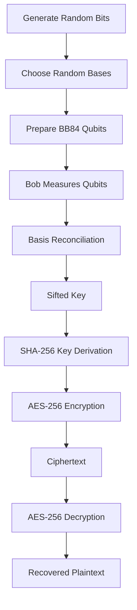

# 📚 Cryptography & Quantum Computing Fundamentals

## Why Quantum Computing Matters

Traditional computers process information using **bits (0 or 1)**. Quantum computers use **qubits**, which exploit **superposition** and **entanglement**, enabling them to solve certain problems exponentially faster. While this opens new possibilities in optimization, AI, and scientific research, it also threatens widely used cryptographic algorithms such as RSA and ECC through **Shor's Algorithm**. Symmetric encryption (AES) remains significantly more resistant, requiring only larger key sizes to counter **Grover's Algorithm**. Your project therefore combines **BB84-inspired Quantum Key Distribution (QKD)** with **AES-256** to improve key security while retaining efficient encryption. 

---

# Classical vs Quantum Computing

| Feature         | Classical Computer  | Quantum Computer             |
| --------------- | ------------------- | ---------------------------- |
| Basic Unit      | Bit (0/1)           | Qubit                        |
| State           | Either 0 or 1       | 0 and 1 simultaneously       |
| Processing      | Sequential/Parallel | Quantum Parallelism          |
| Security Impact | Safe for RSA today  | Can break RSA/ECC (future)   |
| Examples        | CPU, GPU            | IBM Quantum, Google Sycamore |

---

# Fundamentals of Quantum Computing

### 🔹 Qubit

Unlike a classical bit, a qubit can exist in multiple states simultaneously.

### 🔹 Superposition

Allows a qubit to represent both **0 and 1** until measured.

### 🔹 Entanglement

Two qubits become correlated so that measuring one instantly determines the state of the other.

### 🔹 Measurement

Observing a qubit collapses it into either **0** or **1**.

### 🔹 No-Cloning Theorem

Unknown quantum states **cannot be copied**, making QKD naturally resistant to eavesdropping.

---

# Common Quantum Gates

| Gate        | Symbol | Purpose               |
| ----------- | ------ | --------------------- |
| Pauli-X     | X      | Bit Flip              |
| Pauli-Y     | Y      | Bit & Phase Flip      |
| Pauli-Z     | Z      | Phase Flip            |
| Hadamard    | H      | Creates Superposition |
| CNOT        | CX     | Entangles Qubits      |
| Measurement | M      | Reads Qubit           |

---

# BB84 Protocol (Simplified)

```text
Alice
  │
Generate Random Bits
  │
Choose Random Bases (+ / ×)
  │
Prepare Qubits
  │
════════ Quantum Channel ════════
  │
Bob Chooses Random Bases
  │
Measure Qubits
  │
Compare Bases (Public)
  │
Discard Mismatches
  │
Sifted Secret Key
```

**Steps**

1. Alice creates random bits.
2. Alice randomly selects bases (+ or ×).
3. Bob measures using random bases.
4. Matching bases are retained.
5. Remaining bits become the shared secret key.
6. High error rate indicates possible eavesdropping.

---

# Quantum Key Distribution (QKD)

QKD **does not encrypt data**. Instead, it securely distributes encryption keys.

**Advantages**

* Detects eavesdropping
* Information-theoretic security
* Forward secrecy
* Random high-entropy keys

**Limitation**

* Requires quantum communication (simulated in this project).

---

# Basics of Cryptography

Cryptography protects information through mathematical techniques.

### Core Goals

| Principle       | Purpose                     |
| --------------- | --------------------------- |
| Confidentiality | Prevent unauthorized access |
| Integrity       | Detect modification         |
| Authentication  | Verify identity             |
| Non-Repudiation | Prevent denial of actions   |

---

# Types of Cryptography

## Symmetric Encryption

* Same key for encryption & decryption
* Very fast
* Used for bulk data encryption

Examples:

* AES
* ChaCha20
* DES
* Blowfish

---

## Asymmetric Encryption

* Uses Public & Private Keys
* Slower than symmetric encryption
* Mainly used for key exchange and digital signatures

Examples:

* RSA
* ECC
* Diffie-Hellman
* ElGamal

---

# Hash Functions

A hash converts data into a fixed-length fingerprint.

Properties:

* One-way
* Deterministic
* Collision resistant
* Fixed output length

Examples:

* SHA-256
* SHA-3
* BLAKE2
* MD5 (Broken)
* SHA-1 (Broken)

---

# Digital Signatures

Provide:

* Authentication
* Integrity
* Non-repudiation

Common Algorithms:

* RSA Signature
* ECDSA
* EdDSA
* Dilithium (Post-Quantum)

---

# Popular Cryptographic Algorithms

| Algorithm          | Type           | Key Size | Quantum Safe | Status             |
| ------------------ | -------------- | -------- | ------------ | ------------------ |
| DES                | Symmetric      | 56       | ❌            | Obsolete           |
| 3DES               | Symmetric      | 168      | ❌            | Deprecated         |
| AES-128            | Symmetric      | 128      | Partial      | Good               |
| **AES-256**        | Symmetric      | 256      | ✅            | Recommended        |
| Blowfish           | Symmetric      | Variable | Partial      | Legacy             |
| Twofish            | Symmetric      | 256      | Partial      | Secure             |
| ChaCha20           | Symmetric      | 256      | ✅            | Excellent          |
| RSA                | Asymmetric     | 2048+    | ❌            | Vulnerable         |
| ECC                | Asymmetric     | 256      | ❌            | Vulnerable         |
| Diffie-Hellman     | Key Exchange   | Variable | ❌            | Vulnerable         |
| ElGamal            | Asymmetric     | Variable | ❌            | Vulnerable         |
| DSA                | Signature      | Variable | ❌            | Legacy             |
| ECDSA              | Signature      | Variable | ❌            | Vulnerable         |
| EdDSA              | Signature      | 256      | Partial      | Modern             |
| ML-KEM (Kyber)     | PQC            | Variable | ✅            | NIST Standard      |
| ML-DSA (Dilithium) | PQC            | Variable | ✅            | NIST Standard      |
| SPHINCS+           | PQC            | Variable | ✅            | Hash-Based         |
| Falcon             | PQC            | Variable | ✅            | Lattice-Based      |
| XMSS               | PQC            | Variable | ✅            | Stateful Signature |
| HMAC               | Authentication | Variable | ✅            | Widely Used        |

---

# Why AES?

AES is the global standard for symmetric encryption because it provides:

* High security
* Fast performance
* Hardware acceleration (AES-NI)
* Low memory usage
* NIST standardization
* Wide industry adoption
* No practical attacks against full AES

It is trusted by governments, banks, cloud providers, and military organizations worldwide.

---

# Why AES-256?

AES comes in three variants:

| Version     | Key         | Rounds | Effective Quantum Security |
| ----------- | ----------- | ------ | -------------------------- |
| AES-128     | 128-bit     | 10     | ~64-bit                    |
| AES-192     | 192-bit     | 12     | ~96-bit                    |
| **AES-256** | **256-bit** | **14** | **~128-bit**               |

**AES-256 was chosen because:**

* Highest available AES security level.
* Better resistance to Grover's algorithm.
* Long-term protection against future quantum threats.
* Industry standard for highly sensitive data.
* Integrates well with QKD-generated keys. 

---

# Why Not AES-128?

Although AES-128 remains secure today, Grover's algorithm theoretically reduces its effective security to about **64 bits**. AES-256 doubles the key length, restoring approximately **128-bit quantum security** with only a small performance cost.

---

# Why Not RSA?

RSA security depends on the difficulty of factoring large integers.

**Problem:** Shor's Algorithm can factor these integers efficiently on a sufficiently powerful quantum computer.

| Feature           | RSA          | AES-256         |
| ----------------- | ------------ | --------------- |
| Quantum Resistant | ❌            | ✅               |
| Speed             | Slow         | Very Fast       |
| Used For          | Key Exchange | Data Encryption |

---

# Why Not ECC?

ECC relies on the hardness of the **Elliptic Curve Discrete Logarithm Problem**, which is also efficiently solved by Shor's algorithm. Consequently, ECC offers no long-term protection against large-scale quantum computers.

---

# Grover's Algorithm

Grover's algorithm accelerates brute-force key search from:

```
2ⁿ
```

to approximately

```
√(2ⁿ)
```

Meaning:

* AES-128 → ~64-bit effective security
* AES-256 → ~128-bit effective security

AES remains secure by increasing key size.

---

# Shor's Algorithm

Shor's algorithm efficiently solves:

* Integer Factorization
* Discrete Logarithms

Therefore it breaks:

* RSA ❌
* ECC ❌
* Diffie-Hellman ❌

It **does not directly break AES**, making symmetric cryptography more resilient.

---

# Project Architecture

```text
Random Bits
      │
      ▼
 Alice (BB84)
      │
Prepare Qubits
      │
Quantum Channel
      │
Bob Measures
      │
Basis Matching
      │
Sifted Key
      │
SHA-256
      │
AES-256 Key
      │
Encryption
      │
Ciphertext
      │
Decryption
      │
Recovered Plaintext
```

---

# Workflow Diagram



---

# Security Comparison

| Threat                | RSA       | ECC       | AES-256 + QKD |
| --------------------- | --------- | --------- | ------------- |
| Classical Attack      | Medium    | Medium    | Very Low      |
| Quantum Attack        | High      | High      | Low           |
| Key Distribution      | Difficult | Difficult | Secure (QKD)  |
| Data Encryption       | No        | No        | Yes           |
| Long-Term Suitability | ❌         | ❌         | ✅             |

This hybrid approach leverages **BB84-inspired QKD** to establish high-entropy keys and **AES-256** for efficient encryption, providing a practical path toward quantum-resilient communication while remaining executable on classical hardware. 
